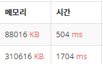

# 입출력

## 입력 객체? 함수?

### Scanner, System.in

nextInt() 이후에 문자를 받고 싶으면
nextLine(); ?? 아니면 다음 문자를 가야하기 때문?

### BufferedReader, InputStreamReader, System.in
StringTokenizer

## 출력

### System.out.println()

### BufferedWriter OutputStreamWriter System.out

- 정수출력 문제